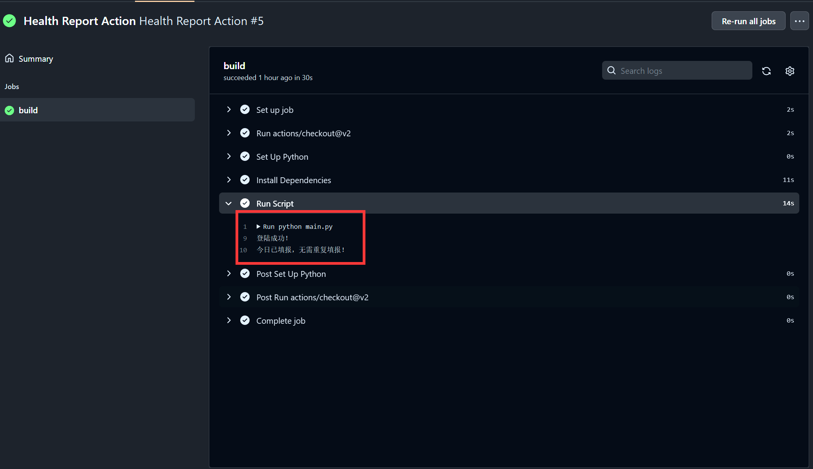

# NWPU_COVID19_AutoReport

此项目 fork 自 [Pinming/NWPU_COVID19_AutoReport](https://github.com/Pinming/NWPU_COVID19_AutoReport)。

添加了对 Github Actions 自动的集成。用于自动提交 NWPU 每日健康报告。

如果只需要自动填报，参考 Github Actions 章节即可。

# Github Actions 部署方法

1. 登录自己的 Github 账号。

2. 将本项目 fork 到自己的仓库。

3. 进入 `Settings` 选项卡，点击 `Secret`，并选择 `New Repository  Secret`。依次添加以下变量：
   - `username`: 学号
   - `password`: 翱翔门户密码


4. 进入 `Actions` 选项卡，等待自动打卡或者手动运行 Action 。

5. 项目默认在北京时间 10:00 自动打卡 (UTC 02:00)，可以根据需要修改 `.github/workflows/report.yml` 中 `cron` 项。

6. 进入 Summary 来查看具体的记录：


7. 打卡失败时 Github Actions 会通过邮件等方式通知，如未启用可以开启`Send notifications for failed workflows only`。

8. 项目默认关闭了微信通知，如果需要请自行 fork 修改。

# 原项目介绍
当前版本 `v2.0.1` (220113-1355)

用于完成西工大每日健康申报的自动化程序。在进行自动填报的同时通过微信推送或 Email 提醒填报结果。
本程序已经适配 2021 年 12 月疫情填报系统改动，确认兼容。

想了解更多，还可以阅读 https://www.pm-z.tech/2020/07/26/Auto_Reporter_For_COVID19

# ⚠️ 使用前请注意！
* 本软件设计之本意为技术学习，请在**遵循法律及学校各项规定**的前提下使用本软件。
* 如您需要使用该软件，请**确保您的身体状况良好**，**如实申报**自身身体状况。
* 若您的身体状况出现异常，应**立即停止**使用本软件、**关闭**云函数自动触发功能，并及时于学校系统更改每日申报情况。
* 因使用该软件误报身体状况而引发的不良后果**应由您自行承担**。
* 本软件原理是提取上一次的填报结果来提交，如果您的所在地发生改变，请**自行手动填报一次**，理论上程序会自动跟进后续的填报并与之同步。如出现异常烦请反馈！
* 该软件并非万能，请**时常检查填报结果**！

# 基本配置方法
适用环境：Python 3.6 及以上版本。
程序已经集成所有第三方库，不需要使用 pip 再次安装。

对于云函数应用，其程序入口为 `index.handler`。

使该程序正确运行，需要编辑 `user_config.py` 中的部分变量，配置 `西工大翱翔门户账号` 和 `Server 酱微信推送信息（可选）`。其他文件一般无需改动。

`user_config.py` 需要设置的变量如下：

变量 | 说明
-- | --
`username` | 填入登录翱翔门户的用户名，通常为学工号
`password` | 填入对应用户的密码
`SC_switcher` |  ServerChan 微信推送服务开关，默认开启服务，赋值为 `1`；填 `0` 则关闭；<br>如果关闭了该服务则不需要配置 `SCKey`。
`SCKEY` |  ServerChan 微信推送服务对应的 Key，用于绑定自己的微信。

> 关于 ServerChan 微信推送的配置，请参阅 [ServerChan 官方页面](https://sct.ftqq.com/sendkey) 。
>
> 其实只要绑定微信获得 `SCKEY` 就可以了，相当简单了。

# 云端部署方法

这里以阿里云函数计算为例。

1) 首先注册一个阿里云账号，然后在控制台中搜索并进入「函数计算」；


2) 点击「服务及函数」；


3) 选择「创建服务」并输入服务名称（可自定义）；


4) 点击「创建函数」；


5) 按图示填入参数；
    > 其中：
    > - 「名称」可自定义；
    > - 「运行环境」选择 `Python 3`；
    > - 其他选项不变；
    > - 内存规格 128MB 已经足够。

    


6) 跳转进入「函数详情」页面，在打开的 IDE 终端中，分步执行如下命令安装源码及所需第三方库：
    ```
    git clone https://github.com/Pinming/NWPU_COVID19_AutoReport.git
    mv ./NWPU_COVID19_AutoReport/* .
    pip install -r requirements.txt -t `pwm`
    ```
    


7) 在 IDE 中修改 `user_config.py`，填入相关字段；


8) 设置完毕后，点击 IDE 右上角「保存并部署」，完成代码部署；


9) 点击左上角「测试函数」，观察运行结果；


10) 测试正常后，加入触发器以保证周期触发程序。在页面上方打开「触发器管理」，点击「创建触发器」。
> 其中：
> - **触发器类型**选择定时触发器；
> - **名称**可自定义；
> - **触发方式**可以选择自己认为合适的方式；
> - 如触发方式选择了 CRON 表达式，表达式可填写为 `CRON_TZ=Asia/Shanghai 0 0 1,7,13,19 * * ?`<br>该表达式即在北京时间每天的 1:00、7:00、13:00、19:00 各执行一次程序。


如果需要关闭云端的自动填报，在该页面禁用创建的触发器即可。


> 在建立函数过程中，你可能会发现关于该功能的收费提示。<br>本函数的请求量、请求时间及耗费公网流量均极小，每天执行三四次水平的请求的花费根本，或者说近似是 0（考虑到公网流量，费用可能是小于 0.01 元的水平），因此不会出账，请放心。<br>具体收费标准详见：https://help.aliyun.com/document_detail/54301.html

此外，你也可以通过 Windows 的「计划任务」或类似功能在本地计算机上定时执行该程序，方法不再赘述。

设计初衷还是为了云函数考虑的，这样更方便一些，不需要本地计算机挂机运行。

期望全人类早日战胜 COVID-19，这个程序能早一天失去它的用武之地~
